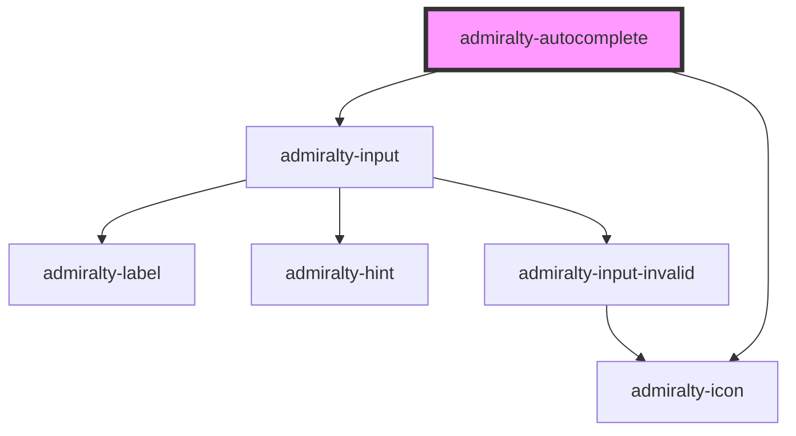

# admiralty-autocomplete

<!-- Auto Generated Below -->

## Properties

| Property             | Attribute               | Description                                                                      | Type      | Default                                                                                                                                                        |
| -------------------- | ----------------------- | -------------------------------------------------------------------------------- | --------- | -------------------------------------------------------------------------------------------------------------------------------------------------------------- |
| `assistiveHint`      | `assistive-hint`        | The assistive hint that is read to the user when the focuses the component       | `string`  | `'When autocomplete results are available use up and down arrows to review and enter to select. Touch device users, explore by touch or with swipe gestures.'` |
| `autoSelect`         | `auto-select`           | Whether to pick the first option by default                                      | `boolean` | `false`                                                                                                                                                        |
| `confirmOnBlur`      | `confirm-on-blur`       | This dictates whether the autocomplete should confirm the choice on blur         | `boolean` | `true`                                                                                                                                                         |
| `disabled`           | `disabled`              | This dictates whether the autocomplete is disabled                               | `boolean` | `false`                                                                                                                                                        |
| `hint`               | `hint`                  | The hint text for the input                                                      | `string`  | `undefined`                                                                                                                                                    |
| `invalid`            | `invalid`               | Whether to show the autocomplete in an invalid state                             | `boolean` | `false`                                                                                                                                                        |
| `invalidMessage`     | `invalid-message`       | The message to show when the autocomplete is invalid                             | `string`  | `undefined`                                                                                                                                                    |
| `label`              | `label`                 | The label text for the input                                                     | `string`  | `undefined`                                                                                                                                                    |
| `minLength`          | `min-length`            | The minimum number of characters that must be entered before it starts filtering | `number`  | `1`                                                                                                                                                            |
| `name`               | `name`                  | The name attribute to apply to the input field                                   | `string`  | `undefined`                                                                                                                                                    |
| `placeholder`        | `placeholder`           | The placeholder text for the input                                               | `string`  | `undefined`                                                                                                                                                    |
| `showAllValues`      | `show-all-values`       | Whether to show all the values when clicked, much like a standard dropdown       | `boolean` | `true`                                                                                                                                                         |
| `showNoOptionsFound` | `show-no-options-found` | Whether to show 'no options found'                                               | `boolean` | `true`                                                                                                                                                         |
| `value`              | `value`                 | The value of the input.                                                          | `any`     | `''`                                                                                                                                                           |

## Events

| Event             | Description                         | Type                                         |
| ----------------- | ----------------------------------- | -------------------------------------------- |
| `admiraltyChange` | Emitted when the value has changed. | `CustomEvent<AutoCompleteChangeEventDetail>` |

## Dependencies

### Depends on

- [admiralty-input](../input)
- [admiralty-icon](../icon)

### Graph

----------------------------------------------

*Built with [StencilJS](https://stenciljs.com/)*
