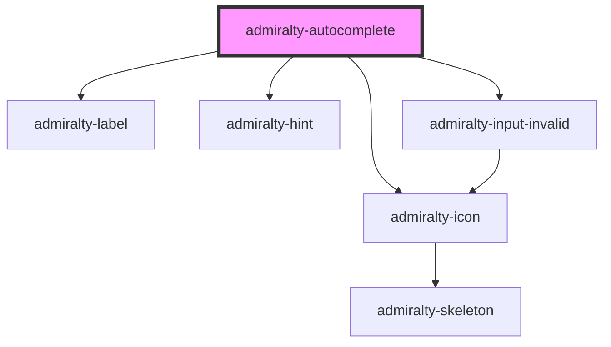

# admiralty-autocomplete


<!-- Auto Generated Below -->


## Properties

| Property             | Attribute               | Description                                                                                                                                                                                                                                                                                                                                                                         | Type                          | Default                                                                                                                                                         |
| -------------------- | ----------------------- | ----------------------------------------------------------------------------------------------------------------------------------------------------------------------------------------------------------------------------------------------------------------------------------------------------------------------------------------------------------------------------------- | ----------------------------- | --------------------------------------------------------------------------------------------------------------------------------------------------------------- |
| `assistiveHint`      | `assistive-hint`        | The hint that is provided to assistive users.                                                                                                                                                                                                                                                                                                                                       | `string`                      | `'When autocomplete results are available use up and down arrows to review and enter to select.  Touch device users, explore by touch or with swipe gestures.'` |
| `autoselect`         | `autoselect`            | Automatically select the first matching option.                                                                                                                                                                                                                                                                                                                                     | `boolean`                     | `false`                                                                                                                                                         |
| `confirmOnBlur`      | `confirm-on-blur`       | Toggle automatically confirming a selection when the field is blurred.                                                                                                                                                                                                                                                                                                              | `boolean`                     | `true`                                                                                                                                                          |
| `cssNamespace`       | `css-namespace`         | The default CSS namespace.                                                                                                                                                                                                                                                                                                                                                          | `string`                      | `'autocomplete'`                                                                                                                                                |
| `disabled`           | `disabled`              | When `true`, the component cannot be interacted with.                                                                                                                                                                                                                                                                                                                               | `boolean`                     | `false`                                                                                                                                                         |
| `displayMenu`        | `display-menu`          | When set to `overlay` this option will display the menu as an absolutely positioned overlay instead of inline.                                                                                                                                                                                                                                                                      | `string`                      | `'inline'`                                                                                                                                                      |
| `filterFunction`     | --                      | Custom filter function that can be used instead of rendering options into the DOM.                                                                                                                                                                                                                                                                                                  | `(query: string) => Option[]` | `undefined`                                                                                                                                                     |
| `hint`               | `hint`                  | TThe text which will be used under the label to describe the input.                                                                                                                                                                                                                                                                                                                 | `string`                      | `null`                                                                                                                                                          |
| `inputClasses`       | `input-classes`         | Classes to add to the component's `<input>` element.                                                                                                                                                                                                                                                                                                                                | `string`                      | `undefined`                                                                                                                                                     |
| `invalid`            | `invalid`               | Whether to show that the component is in an invalid state.                                                                                                                                                                                                                                                                                                                          | `boolean`                     | `false`                                                                                                                                                         |
| `invalidMessage`     | `invalid-message`       | The message to show when the component is invalid.                                                                                                                                                                                                                                                                                                                                  | `string`                      | `null`                                                                                                                                                          |
| `label`              | `label`                 | The text that will be used as a field label.                                                                                                                                                                                                                                                                                                                                        | `string`                      | `null`                                                                                                                                                          |
| `menuAttributes`     | `menu-attributes`       | Sets HTML attributes and their values on the generated `ul` menu element. Useful for adding `aria-labelledby` and setting to the value of the `id` attribute on your existing label, to provide context to an assistive technology user. e.g. ``` const menuAttributes = {   className: 'custom-className',   class: 'custom-class',   id: 'custom-id',   role: 'custom-role' } ``` | `any`                         | `undefined`                                                                                                                                                     |
| `menuClasses`        | `menu-classes`          | Classes to add to the menu displaying the options.                                                                                                                                                                                                                                                                                                                                  | `string`                      | `undefined`                                                                                                                                                     |
| `minLength`          | `min-length`            | Prevent displaying options until the minimum string length is reached. Ignored when show all values is enabled.                                                                                                                                                                                                                                                                     | `number`                      | `0`                                                                                                                                                             |
| `name`               | `name`                  | The name for the `<input>` element.                                                                                                                                                                                                                                                                                                                                                 | `string`                      | `undefined`                                                                                                                                                     |
| `placeholder`        | `placeholder`           | Populate the placeholder attribute on the `<input>` element.                                                                                                                                                                                                                                                                                                                        | `string`                      | `''`                                                                                                                                                            |
| `required`           | `required`              | Populates the required field on the `<input>` element.                                                                                                                                                                                                                                                                                                                              | `boolean`                     | `false`                                                                                                                                                         |
| `showAllValues`      | `show-all-values`       | Toggle showing all values when the input is clicked, like a default dropdown. This will hide the chevron when set to false.                                                                                                                                                                                                                                                         | `boolean`                     | `true`                                                                                                                                                          |
| `showNoOptionsFound` | `show-no-options-found` | Toggle whether to display the "No results found" message.                                                                                                                                                                                                                                                                                                                           | `boolean`                     | `true`                                                                                                                                                          |
| `value`              | `value`                 | The value of the input.                                                                                                                                                                                                                                                                                                                                                             | `string`                      | `null`                                                                                                                                                          |


## Events

| Event             | Description                         | Type                                         |
| ----------------- | ----------------------------------- | -------------------------------------------- |
| `admiraltyChange` | Emitted when the value has changed. | `CustomEvent<AutoCompleteChangeEventDetail>` |


## Dependencies

### Depends on

- [admiralty-label](../label)
- [admiralty-hint](../hint)
- [admiralty-icon](../icon)
- [admiralty-input-invalid](../input-invalid)

### Graph


----------------------------------------------

*Built with [StencilJS](https://stenciljs.com/)*
