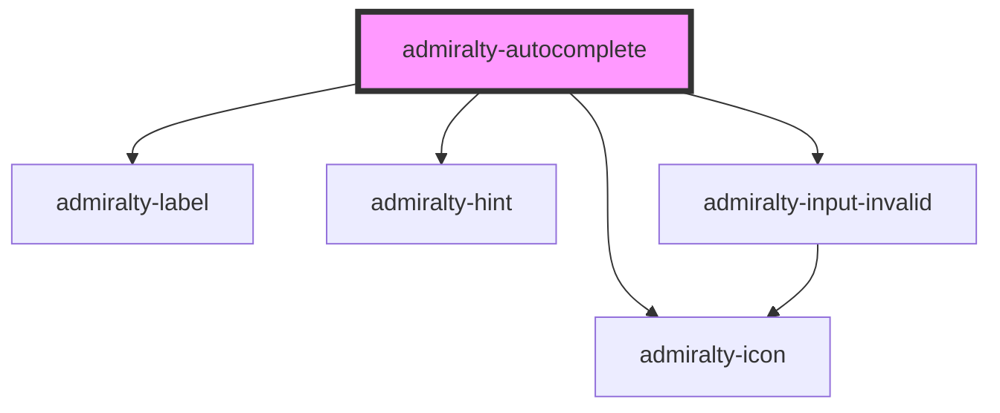

# admiralty-autocomplete

<!-- Auto Generated Below -->

## Properties

| Property             | Attribute               | Description                                                         | Type      | Default                                                                                                                                                         |
| -------------------- | ----------------------- | ------------------------------------------------------------------- | --------- | --------------------------------------------------------------------------------------------------------------------------------------------------------------- |
| `assistiveHint`      | `assistive-hint`        |                                                                     | `string`  | `'When autocomplete results are available use up and down arrows to review and enter to select.  Touch device users, explore by touch or with swipe gestures.'` |
| `autoselect`         | `autoselect`            |                                                                     | `boolean` | `false`                                                                                                                                                         |
| `confirmOnBlur`      | `confirm-on-blur`       |                                                                     | `boolean` | `true`                                                                                                                                                          |
| `cssNamespace`       | `css-namespace`         |                                                                     | `string`  | `'autocomplete'`                                                                                                                                                |
| `disabled`           | `disabled`              | When `true`, the component cannot be interacted with.               | `boolean` | `false`                                                                                                                                                         |
| `displayMenu`        | `display-menu`          |                                                                     | `string`  | `'inline'`                                                                                                                                                      |
| `dropdownArrow`      | `dropdown-arrow`        |                                                                     | `any`     | `undefined`                                                                                                                                                     |
| `hint`               | `hint`                  | TThe text which will be used under the label to describe the input. | `string`  | `null`                                                                                                                                                          |
| `hintClasses`        | `hint-classes`          |                                                                     | `string`  | `undefined`                                                                                                                                                     |
| `inputClasses`       | `input-classes`         |                                                                     | `string`  | `undefined`                                                                                                                                                     |
| `invalid`            | `invalid`               | Whether to show that the component is in an invalid state.          | `boolean` | `false`                                                                                                                                                         |
| `invalidMessage`     | `invalid-message`       | The message to show when the component is invalid.                  | `string`  | `null`                                                                                                                                                          |
| `label`              | `label`                 | The text that will be used as a field label.                        | `string`  | `null`                                                                                                                                                          |
| `menuAttributes`     | `menu-attributes`       |                                                                     | `any`     | `undefined`                                                                                                                                                     |
| `menuClasses`        | `menu-classes`          |                                                                     | `string`  | `undefined`                                                                                                                                                     |
| `minLength`          | `min-length`            |                                                                     | `number`  | `0`                                                                                                                                                             |
| `name`               | `name`                  |                                                                     | `string`  | `'input-autocomplete'`                                                                                                                                          |
| `placeholder`        | `placeholder`           |                                                                     | `string`  | `''`                                                                                                                                                            |
| `required`           | `required`              |                                                                     | `boolean` | `false`                                                                                                                                                         |
| `showAllValues`      | `show-all-values`       |                                                                     | `boolean` | `true`                                                                                                                                                          |
| `showNoOptionsFound` | `show-no-options-found` |                                                                     | `boolean` | `true`                                                                                                                                                          |
| `value`              | `value`                 | The value of the input.                                             | `string`  | `''`                                                                                                                                                            |

## Events

| Event             | Description                         | Type                                         |
| ----------------- | ----------------------------------- | -------------------------------------------- |
| `admiraltyChange` | Emitted when the value has changed. | `CustomEvent<AutoCompleteChangeEventDetail>` |

## Dependencies

### Depends on

- [admiralty-label](../label)
- [admiralty-hint](../hint)
- [admiralty-icon](../icon)
- [admiralty-input-invalid](../input-invalid)

### Graph

----------------------------------------------

*Built with [StencilJS](https://stenciljs.com/)*
