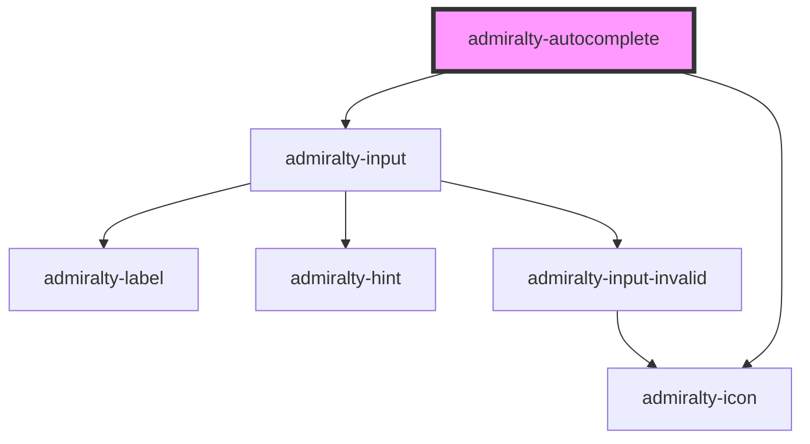

# admiralty-autocomplete

<!-- Auto Generated Below -->

## Properties

| Property             | Attribute               | Description | Type      | Default                                                                                                                                                        |
| -------------------- | ----------------------- | ----------- | --------- | -------------------------------------------------------------------------------------------------------------------------------------------------------------- |
| `assistiveHint`      | `assistive-hint`        |             | `string`  | `'When autocomplete results are available use up and down arrows to review and enter to select. Touch device users, explore by touch or with swipe gestures.'` |
| `autoSelect`         | `auto-select`           |             | `boolean` | `false`                                                                                                                                                        |
| `defaultValue`       | `default-value`         |             | `string`  | `''`                                                                                                                                                           |
| `hint`               | `hint`                  |             | `string`  | `undefined`                                                                                                                                                    |
| `label`              | `label`                 |             | `string`  | `undefined`                                                                                                                                                    |
| `minLength`          | `min-length`            |             | `number`  | `1`                                                                                                                                                            |
| `name`               | `name`                  |             | `string`  | `undefined`                                                                                                                                                    |
| `placeholder`        | `placeholder`           |             | `string`  | `undefined`                                                                                                                                                    |
| `showAllValues`      | `show-all-values`       |             | `boolean` | `true`                                                                                                                                                         |
| `showNoOptionsFound` | `show-no-options-found` |             | `boolean` | `true`                                                                                                                                                         |

## Events

| Event             | Description                         | Type                                         |
| ----------------- | ----------------------------------- | -------------------------------------------- |
| `admiraltyChange` | Emitted when the value has changed. | `CustomEvent<AutoCompleteChangeEventDetail>` |

## Dependencies

### Depends on

- [admiralty-input](../input)
- [admiralty-icon](../icon)

### Graph

----------------------------------------------

*Built with [StencilJS](https://stenciljs.com/)*
