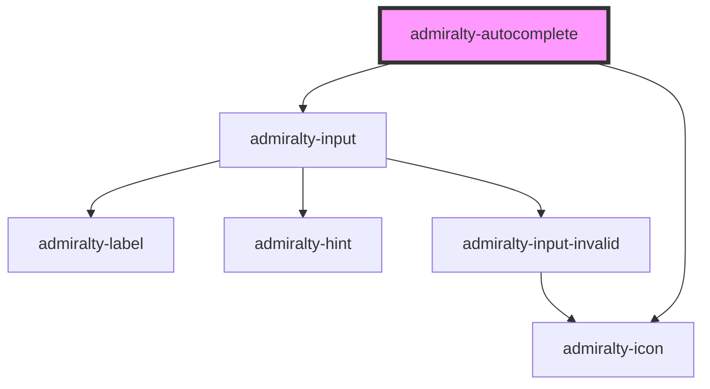

# admiralty-autocomplete

<!-- Auto Generated Below -->

## Properties

| Property             | Attribute               | Description | Type      | Default |
| -------------------- | ----------------------- | ----------- | --------- | ------- |
| `autoSelect`         | `auto-select`           |             | `boolean` | `false` |
| `defaultValue`       | `default-value`         |             | `string`  | `''`    |
| `minLength`          | `min-length`            |             | `number`  | `1`     |
| `showAllValues`      | `show-all-values`       |             | `boolean` | `true`  |
| `showNoOptionsFound` | `show-no-options-found` |             | `boolean` | `true`  |

## Dependencies

### Depends on

- [admiralty-input](../input)
- [admiralty-icon](../icon)

### Graph

----------------------------------------------

*Built with [StencilJS](https://stenciljs.com/)*
