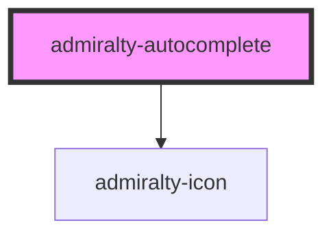

# admiralty-autocomplete

<!-- Auto Generated Below -->

## Properties

| Property             | Attribute               | Description             | Type      | Default                                                                                                                                                         |
| -------------------- | ----------------------- | ----------------------- | --------- | --------------------------------------------------------------------------------------------------------------------------------------------------------------- |
| `assistiveHint`      | `assistive-hint`        |                         | `string`  | `'When autocomplete results are available use up and down arrows to review and enter to select.  Touch device users, explore by touch or with swipe gestures.'` |
| `autoselect`         | `autoselect`            |                         | `boolean` | `false`                                                                                                                                                         |
| `confirmOnBlur`      | `confirm-on-blur`       |                         | `boolean` | `true`                                                                                                                                                          |
| `cssNamespace`       | `css-namespace`         |                         | `string`  | `'autocomplete'`                                                                                                                                                |
| `displayMenu`        | `display-menu`          |                         | `string`  | `'inline'`                                                                                                                                                      |
| `dropdownArrow`      | `dropdown-arrow`        |                         | `any`     | `undefined`                                                                                                                                                     |
| `hintClasses`        | `hint-classes`          |                         | `string`  | `undefined`                                                                                                                                                     |
| `inputClasses`       | `input-classes`         |                         | `string`  | `undefined`                                                                                                                                                     |
| `menuAttributes`     | `menu-attributes`       |                         | `any`     | `undefined`                                                                                                                                                     |
| `menuClasses`        | `menu-classes`          |                         | `string`  | `undefined`                                                                                                                                                     |
| `minLength`          | `min-length`            |                         | `number`  | `0`                                                                                                                                                             |
| `name`               | `name`                  |                         | `string`  | `'input-autocomplete'`                                                                                                                                          |
| `placeholder`        | `placeholder`           |                         | `string`  | `''`                                                                                                                                                            |
| `required`           | `required`              |                         | `boolean` | `false`                                                                                                                                                         |
| `showAllValues`      | `show-all-values`       |                         | `boolean` | `true`                                                                                                                                                          |
| `showNoOptionsFound` | `show-no-options-found` |                         | `boolean` | `true`                                                                                                                                                          |
| `value`              | `value`                 | The value of the input. | `string`  | `''`                                                                                                                                                            |

## Events

| Event             | Description                         | Type                                         |
| ----------------- | ----------------------------------- | -------------------------------------------- |
| `admiraltyChange` | Emitted when the value has changed. | `CustomEvent<AutoCompleteChangeEventDetail>` |

## Dependencies

### Depends on

- [admiralty-icon](../icon)

### Graph

----------------------------------------------

*Built with [StencilJS](https://stenciljs.com/)*
