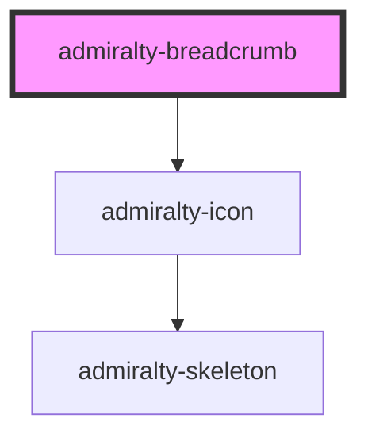

# admiralty-breadcrumb

<!-- Auto Generated Below -->

## Properties

| Property | Attribute | Description                                                                                                                                                       | Type      | Default     |
| -------- | --------- | ----------------------------------------------------------------------------------------------------------------------------------------------------------------- | --------- | ----------- |
| `active` | `active`  | When `true` the breadcrumb will by styled to show that it is the currently active breadcrumb. Defaults to `true` for the last breadcrumb if it is not set on any. | `boolean` | `false`     |
| `href`   | `href`    | Contains a URL or a URL fragment that the hyperlink points to.                                                                                                    | `string`  | `undefined` |

## Dependencies

### Depends on

- [admiralty-icon](../icon)

### Graph

----------------------------------------------

*Built with [StencilJS](https://stenciljs.com/)*
