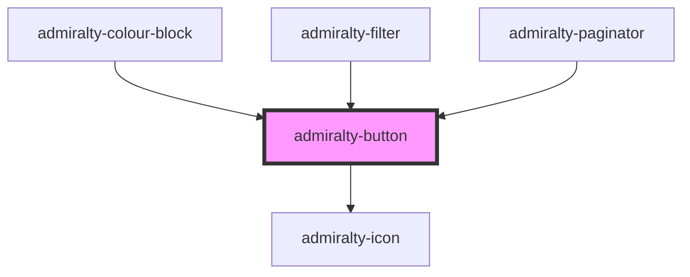

# admiralty-button

<!-- Auto Generated Below -->

## Properties

| Property     | Attribute    | Description                                                                                                                                                                            | Type                                                                            | Default     |
| ------------ | ------------ | -------------------------------------------------------------------------------------------------------------------------------------------------------------------------------------- | ------------------------------------------------------------------------------- | ----------- |
| `borderless` | `borderless` | The default behavior of the button. Valid values are `button`, `submit` and `reset`. Default value is `submit`.                                                                        | `boolean`                                                                       | `false`     |
| `disabled`   | `disabled`   | Determines whether the button is disabled. A button in disabled state will not fire click output events.                                                                               | `boolean`                                                                       | `false`     |
| `form`       | `form`       | The `<form>` element to associate the button with (its form owner).                                                                                                                    | `string`                                                                        | `undefined` |
| `icon`       | `icon`       | When passed Material Icon name, then an icon will be rendered.                                                                                                                         | `string`                                                                        | `undefined` |
| `name`       | `name`       | The name of the button, submitted as a pair with the button's value as part of the form data, when that button is used to submit the form.                                             | `string`                                                                        | `undefined` |
| `type`       | `type`       | Default value is false                                                                                                                                                                 | `"button" \| "reset" \| "submit"`                                               | `'submit'`  |
| `value`      | `value`      | Defines the value associated with the button's name when it's submitted with the form data. This value is passed to the server in params when the form is submitted using this button. | `string`                                                                        | `undefined` |
| `variant`    | `variant`    | The type of button to render. Valid values are `primary`, `secondary`, `warning`, `text` and `icon`. Default value is `primary`.                                                       | `"icon" \| "icon-secondary" \| "primary" \| "secondary" \| "text" \| "warning"` | `'primary'` |

## CSS Custom Properties

| Name                                                    | Description                                         |
| ------------------------------------------------------- | --------------------------------------------------- |
| `--admiralty-button-defaults-idiomatic-padding`         | Padding for the button defaults idiomatic element   |
| `--admiralty-button-defaults-padding`                   | Padding for the button defaults                     |
| `--admiralty-button-focus-padding`                      | Padding for the button focus                        |
| `--admiralty-button-font-size`                          | Font size of the button                             |
| `--admiralty-button-font-weight`                        | Font weight of the button                           |
| `--admiralty-button-icon-focus-padding`                 | Padding for the button icon when focused            |
| `--admiralty-button-icon-hover-padding`                 | Padding for the button icon when hovering           |
| `--admiralty-button-icon-idiomatic-margin`              | Margin for the button icon idiomatic element        |
| `--admiralty-button-icon-idiomatic-padding`             | Padding for the button icon idiomatic element       |
| `--admiralty-button-icon-padding`                       | Padding for the button icon                         |
| `--admiralty-button-idiomatic-padding`                  | Padding left for the button idiomatic element       |
| `--admiralty-button-idiomatic-padding-left`             | Padding left for the button idiomatic element       |
| `--admiralty-button-not-desktop-padding`                | Padding for the button when not in desktop view     |
| `--admiralty-button-primary-hover-focus-active-padding` | Padding for the primary button when in active state |
| `--admiralty-button-primary-hover-focus-padding`        | Padding for the primary button when in focus state  |
| `--admiralty-button-primary-hover-padding`              | Padding for the primary button when hovering        |
| `--admiralty-button-secondary-hover-padding`            | Padding for the secondary button when hovering      |
| `--admiralty-button-text-focus-padding`                 | Padding for the button text when focused            |
| `--admiralty-button-warning-hover-padding`              | Padding for the warning button when hovering        |

## Dependencies

### Used by

 - [admiralty-colour-block](../colour-block)
 - [admiralty-filter](../filter)
 - [admiralty-paginator](../paginator)

### Depends on

- [admiralty-icon](../icon)

### Graph

----------------------------------------------

*Built with [StencilJS](https://stenciljs.com/)*
