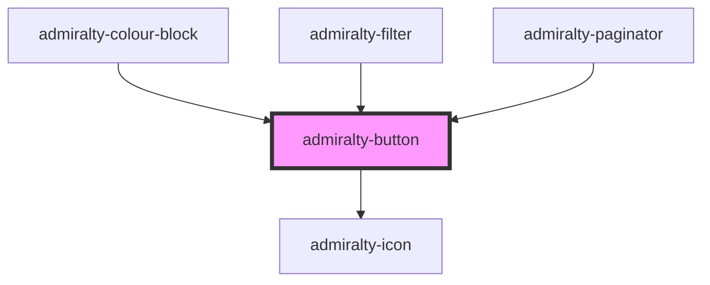

# admiralty-button

<!-- Auto Generated Below -->

## Properties

| Property   | Attribute  | Description                                                                                                                                                                            | Type                                                        | Default     |
| ---------- | ---------- | -------------------------------------------------------------------------------------------------------------------------------------------------------------------------------------- | ----------------------------------------------------------- | ----------- |
| `disabled` | `disabled` | Determines whether the button is disabled. A button in disabled state will not fire click output events.                                                                               | `boolean`                                                   | `false`     |
| `form`     | `form`     | The `<form>` element to associate the button with (its form owner).                                                                                                                    | `string`                                                    | `undefined` |
| `icon`     | `icon`     | When passed Font Awesome Icon name, then an icon will be rendered.                                                                                                                     | `string`                                                    | `undefined` |
| `name`     | `name`     | The name of the button, submitted as a pair with the button's value as part of the form data, when that button is used to submit the form.                                             | `string`                                                    | `undefined` |
| `type`     | `type`     | The default behavior of the button. Valid values are `button`, `submit` and `reset`. Default value is `submit`.                                                                        | `"button" \| "reset" \| "submit"`                           | `'submit'`  |
| `value`    | `value`    | Defines the value associated with the button's name when it's submitted with the form data. This value is passed to the server in params when the form is submitted using this button. | `string`                                                    | `undefined` |
| `variant`  | `variant`  | The type of button to render. Valid values are `primary`, `secondary`, `warning`, `text` and `icon`. Default value is `primary`.                                                       | `"icon" \| "primary" \| "secondary" \| "text" \| "warning"` | `'primary'` |

## CSS Custom Properties

| Name                             | Description               |
| -------------------------------- | ------------------------- |
| `--admiralty-button-font-size`   | Font size of the button   |
| `--admiralty-button-font-weight` | Font weight of the button |

## Dependencies

### Used by

 - [admiralty-colour-block](../colour-block)
 - [admiralty-filter](../filter)
 - [admiralty-paginator](../paginator)

### Depends on

- [admiralty-icon](../icon)

### Graph

----------------------------------------------

*Built with [StencilJS](https://stenciljs.com/)*
