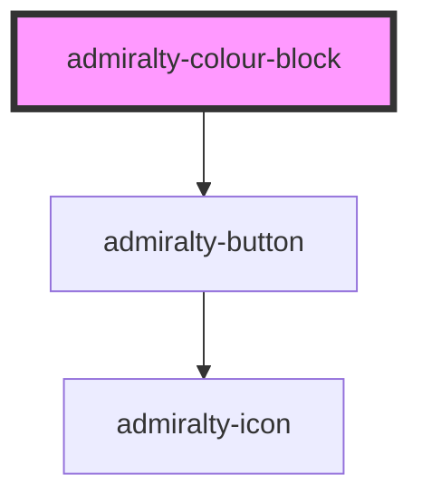

# admiralty-colour-block

<!-- Auto Generated Below -->

## Properties

| Property           | Attribute           | Description                                                                                                                                                                                         | Type                                          | Default            |
| ------------------ | ------------------- | --------------------------------------------------------------------------------------------------------------------------------------------------------------------------------------------------- | --------------------------------------------- | ------------------ |
| `actionText`       | `action-text`       | **[DEPRECATED]** in favour of `href` and `linkText`  The text to display on the action button                                                                | `string`                                      | `undefined`        |
| `colour`           | `colour`            | The background colour of the component.                                                                                                                                                             | `"admiralty-blue" \| "bright-blue" \| "teal"` | `'admiralty-blue'` |
| `enableCardEvent`  | `enable-card-event` | Allow the card to be clicked. Will emit a `colourBlockLinkClicked` event. A value for `href` should also be provided to ensure the component conforms to accessibility standards.                   | `boolean`                                     | `false`            |
| `heading`          | `heading`           | The heading text to display.                                                                                                                                                                        | `string`                                      | `undefined`        |
| `height`           | `height`            | The height in pixels of the component.                                                                                                                                                              | `number`                                      | `undefined`        |
| `href`             | `href`              | The URL to link to.                                                                                                                                                                                 | `string`                                      | `undefined`        |
| `linkText`         | `link-text`         | The link text.                                                                                                                                                                                      | `string`                                      | `undefined`        |
| `suppressRedirect` | `suppress-redirect` | Causes the default browser redirect to be suppressed. Can be used in conjunction with the `colourBlockLinkClicked` event to use a navigation router and prevent a full page reload when navigating. | `boolean`                                     | `false`            |
| `width`            | `width`             | The width in pixels of the component.                                                                                                                                                               | `number`                                      | `undefined`        |

## Events

| Event                    | Description                                             | Type                  |
| ------------------------ | ------------------------------------------------------- | --------------------- |
| `colourBlockLinkClicked` | An event emitted when this Colour Block link is clicked | `CustomEvent<string>` |

## CSS Custom Properties

| Name                                                    | Description                                                   |
| ------------------------------------------------------- | ------------------------------------------------------------- |
| `--admiralty-colour-block-action-font-size`             | Font size of the colour block action                          |
| `--admiralty-colour-block-action-font-weight`           | Font weight of the colour block action                        |
| `--admiralty-colour-block-action-not-desktop-font-size` | Font size of the colour block action when not in desktop view |

## Dependencies

### Depends on

- [admiralty-button](../button)

### Graph

----------------------------------------------

*Built with [StencilJS](https://stenciljs.com/)*
