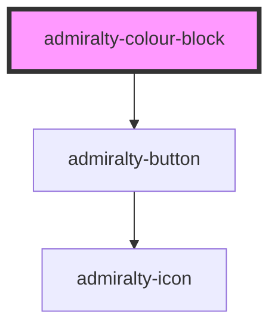

# admiralty-colour-block

<!-- Auto Generated Below -->

## Properties

| Property      | Attribute     | Description                                             | Type                                          | Default            |
| ------------- | ------------- | ------------------------------------------------------- | --------------------------------------------- | ------------------ |
| `actionText`  | `action-text` | The text to display on the action button                | `string`                                      | `undefined`        |
| `clickAction` | --            | The function to call when the action button is pressed. | `() => any`                                   | `undefined`        |
| `colour`      | `colour`      | The background colour of the component.                 | `"admiralty-blue" \| "bright-blue" \| "teal"` | `'admiralty-blue'` |
| `heading`     | `heading`     | The heading text to display.                            | `string`                                      | `undefined`        |
| `height`      | `height`      | The height in pixels of the component.                  | `number`                                      | `undefined`        |
| `width`       | `width`       | The width in pixels of the component.                   | `number`                                      | `undefined`        |

## Dependencies

### Depends on

- [admiralty-button](../button)

### Graph

----------------------------------------------

*Built with [StencilJS](https://stenciljs.com/)*
