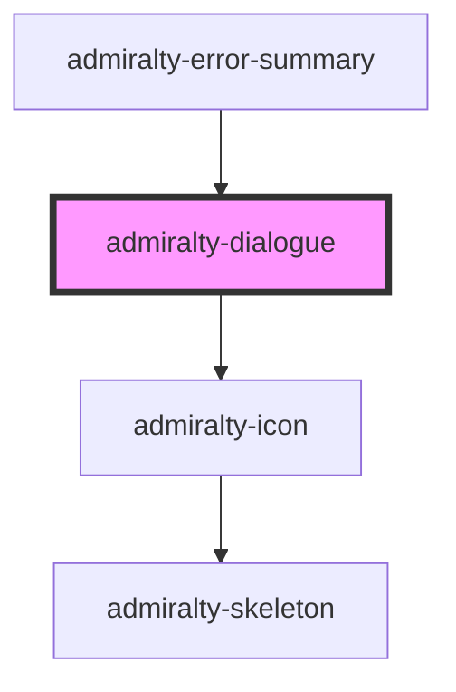

# admiralty-dialogue

<!-- Auto Generated Below -->

## Properties

| Property      | Attribute      | Description                                                                                                               | Type                                          | Default     |
| ------------- | -------------- | ------------------------------------------------------------------------------------------------------------------------- | --------------------------------------------- | ----------- |
| `heading`     | `heading`      | The heading to display.                                                                                                   | `string`                                      | `undefined` |
| `sectionRole` | `section-role` | The role to give the dialogue section. Set this to `alert` if the dialogue box is being used to summarise error messages. | `"alert"`                                     | `undefined` |
| `type`        | `type`         | The type of dialogue box to render.                                                                                       | `"error" \| "info" \| "success" \| "warning"` | `'info'`    |

## CSS Custom Properties

| Name                                            | Description                                        |
| ----------------------------------------------- | -------------------------------------------------- |
| `--admiralty-dialogue-not-desktop-padding`      | Padding for the dialogue when not in desktop view. |
| `--admiralty-dialogue-padding`                  | Padding for the dialogue.                          |
| `--admiralty-dialogue-title-font-size`          | Font size of the dialogue title                    |
| `--admiralty-dialogue-title-font-weight`        | Font weight of the dialogue title                  |
| `--admiralty-dialogue-title-heading-margin`     | Margin bottom for the dialogue title heading.      |
| `--admiralty-dialogue-title-icon-font-size`     | Font size of the dialogue title icon               |
| `--admiralty-dialogue-title-icon-margin-bottom` | Margin bottom for the dialogue icon.               |
| `--admiralty-dialogue-title-icon-margin-right`  | Margin right for the dialogue icon.                |
| `--admiralty-dialogue-title-margin-bottom`      | Margin bottom for the dialogue title.              |

## Dependencies

### Used by

 - [admiralty-error-summary](../error-summary)

### Depends on

- [admiralty-icon](../icon)

### Graph

----------------------------------------------

*Built with [StencilJS](https://stenciljs.com/)*
