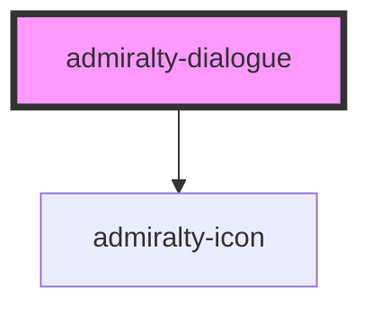

# admiralty-dialogue

<!-- Auto Generated Below -->

## Properties

| Property  | Attribute | Description                         | Type                                          | Default     |
| --------- | --------- | ----------------------------------- | --------------------------------------------- | ----------- |
| `heading` | `heading` | The heading to display.             | `string`                                      | `undefined` |
| `type`    | `type`    | The type of dialogue box to render. | `"error" \| "info" \| "success" \| "warning"` | `'info'`    |

## Dependencies

### Depends on

- [admiralty-icon](../icon)

### Graph

----------------------------------------------

*Built with [StencilJS](https://stenciljs.com/)*
