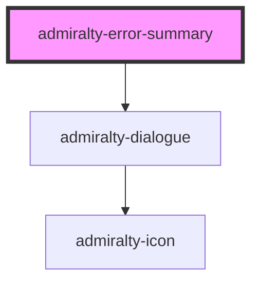

# admiralty-dialogue

<!-- Auto Generated Below -->

## Properties

| Property  | Attribute | Description             | Type     | Default               |
| --------- | --------- | ----------------------- | -------- | --------------------- |
| `heading` | `heading` | The heading to display. | `string` | `"There's a problem"` |

## Slots

| Slot | Description                                                                                                                                                                                                                                                                                                                                                                                                                                                                                 |
| ---- | ------------------------------------------------------------------------------------------------------------------------------------------------------------------------------------------------------------------------------------------------------------------------------------------------------------------------------------------------------------------------------------------------------------------------------------------------------------------------------------------- |
|      | Error messages should be placed in the slot. Each error message should use the same wording as the original error message on the input component. Each error message should be a link that links back to the input component by using the unique `identifier` attribute e.g.  `<admiralty-link href="#name">Enter your full name</admiralty-link>`  would use the `name` ID to link to the input field:  `<admiralty-input identifier="name" label="What is your name?"></admiralty-input>` |

## Dependencies

### Depends on

- [admiralty-dialogue](../dialogue)

### Graph

----------------------------------------------

*Built with [StencilJS](https://stenciljs.com/)*
