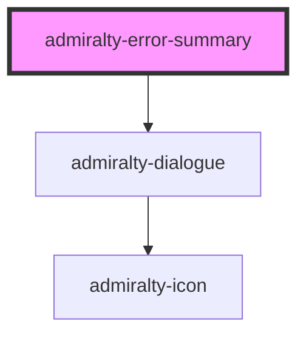

# admiralty-dialogue

<!-- Auto Generated Below -->

## Properties

| Property  | Attribute | Description             | Type     | Default               |
| --------- | --------- | ----------------------- | -------- | --------------------- |
| `heading` | `heading` | The heading to display. | `string` | `"There's a problem"` |

## Slots

| Slot | Description                                                                                                                                                                                                                                                                                                                                                                                                                                                                                                                                                                                                                                                                           |
| ---- | ------------------------------------------------------------------------------------------------------------------------------------------------------------------------------------------------------------------------------------------------------------------------------------------------------------------------------------------------------------------------------------------------------------------------------------------------------------------------------------------------------------------------------------------------------------------------------------------------------------------------------------------------------------------------------------- |
|      | Error messages should be placed in the slot. Each error message should use the same wording as the original error message on the input component.  For optimal accessibility, each error message should be rendered as a link that links back to the input component. e.g.  `<admiralty-link href="#name-input">Enter your full name</admiralty-link>`  would link to the input field:  `<admiralty-input id="name" label="What is your name?"></admiralty-input>`  The `<input>` element of the component should be the target of the link and not the outer component wrapper so that the focus is applied correctly. The ID of the input element is the ID suffixed with `-input`. |

## Dependencies

### Depends on

- [admiralty-dialogue](../dialogue)

### Graph

----------------------------------------------

*Built with [StencilJS](https://stenciljs.com/)*
