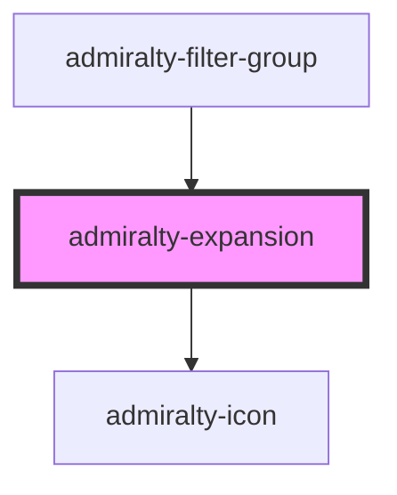

# admiralty-expansion

<!-- Auto Generated Below -->

## Properties

| Property            | Attribute             | Description                                                         | Type      | Default     |
| ------------------- | --------------------- | ------------------------------------------------------------------- | --------- | ----------- |
| `alignHeadingRight` | `align-heading-right` | CWhether the heading should be right aligned.                       | `boolean` | `false`     |
| `expanded`          | `expanded`            | Whether the component is expanded.                                  | `boolean` | `false`     |
| `heading`           | `heading`             | The text to display in the heading of the expansion component.      | `string`  | `undefined` |
| `hideBorder`        | `hide-border`         | Whether the border on the bottom of the component should be hidden. | `boolean` | `false`     |

## Events

| Event     | Description                                                       | Type                   |
| --------- | ----------------------------------------------------------------- | ---------------------- |
| `toggled` | The event that is dispatched when the expanded status is toggled. | `CustomEvent<boolean>` |

## Dependencies

### Used by

 - [admiralty-filter-group](../filter-group)

### Depends on

- [admiralty-icon](../icon)

### Graph

----------------------------------------------

*Built with [StencilJS](https://stenciljs.com/)*
