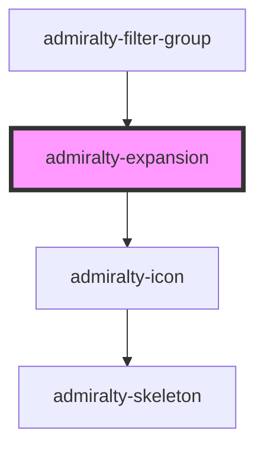

# admiralty-expansion

<!-- Auto Generated Below -->

## Properties

| Property            | Attribute             | Description                                                         | Type      | Default     |
| ------------------- | --------------------- | ------------------------------------------------------------------- | --------- | ----------- |
| `alignHeadingRight` | `align-heading-right` | CWhether the heading should be right aligned.                       | `boolean` | `false`     |
| `expanded`          | `expanded`            | Whether the component is expanded.                                  | `boolean` | `false`     |
| `heading`           | `heading`             | The text to display in the heading of the expansion component.      | `string`  | `undefined` |
| `hideBorder`        | `hide-border`         | Whether the border on the bottom of the component should be hidden. | `boolean` | `false`     |

## Events

| Event     | Description                                                       | Type                   |
| --------- | ----------------------------------------------------------------- | ---------------------- |
| `toggled` | The event that is dispatched when the expanded status is toggled. | `CustomEvent<boolean>` |

## CSS Custom Properties

| Name                                                 | Description                               |
| ---------------------------------------------------- | ----------------------------------------- |
| `--admiralty-expansion-button-heading-margin-bottom` | Margin bottom for the button heading.     |
| `--admiralty-expansion-button-icon-margin-left`      | Margin left for the button icon.          |
| `--admiralty-expansion-button-margin`                | Margin for the expansion button.          |
| `--admiralty-expansion-button-padding`               | Padding for the expansion button.         |
| `--admiralty-expansion-content-padding-bottom`       | Padding bottom for the expansion content. |
| `--admiralty-expansion-padding`                      | Padding for the expansion.                |
| `--admiralty-expansion-title-font-size`              | Font size of the expansion title          |
| `--admiralty-expansion-title-font-weight`            | Font weight of the expansion title        |

## Dependencies

### Used by

 - [admiralty-filter-group](../filter-group)

### Depends on

- [admiralty-icon](../icon)

### Graph

----------------------------------------------

*Built with [StencilJS](https://stenciljs.com/)*
