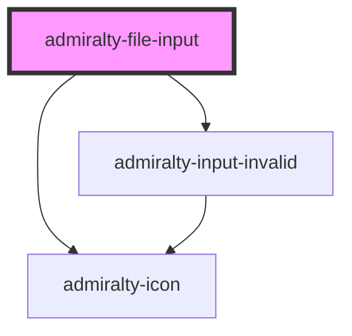

# file-input

<!-- Auto Generated Below -->

## Properties

| Property         | Attribute         | Description                                                                                | Type      | Default                               |
| ---------------- | ----------------- | ------------------------------------------------------------------------------------------ | --------- | ------------------------------------- |
| `identifier`     | `identifier`      | The unique identifier to give the `input` element                                          | `string`  | `undefined`                           |
| `invalid`        | `invalid`         | Whether to show that the file input is in an invalid state.                                | `boolean` | `false`                               |
| `invalidMessage` | `invalid-message` | The message to show when the file input is invalid.                                        | `string`  | `null`                                |
| `label`          | `label`           | Used to display instructions to the user and is replaced with the filename the user inputs | `string`  | `'Click to choose a file or drag it'` |
| `multiple`       | `multiple`        | If true, enables multiple files to be selected or dragged                                  | `boolean` | `false`                               |

## Events

| Event             | Description                            | Type                                      |
| ----------------- | -------------------------------------- | ----------------------------------------- |
| `fileInputChange` | Emitted when the added file(s) changes | `CustomEvent<FileInputChangeEventDetail>` |

## Dependencies

### Depends on

- [admiralty-icon](../icon)
- [admiralty-input-invalid](../input-invalid)

### Graph

----------------------------------------------

*Built with [StencilJS](https://stenciljs.com/)*
