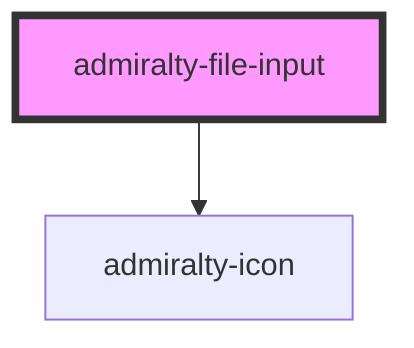

# file-input

<!-- Auto Generated Below -->

## Properties

| Property   | Attribute  | Description                                                                                | Type      | Default                               |
| ---------- | ---------- | ------------------------------------------------------------------------------------------ | --------- | ------------------------------------- |
| `label`    | `label`    | Used to display instructions to the user and is replaced with the filename the user inputs | `string`  | `'Click to choose a file or drag it'` |
| `multiple` | `multiple` | If true, enables multiple files to be selected or dragged                                  | `boolean` | `false`                               |

## Events

| Event             | Description                            | Type                                      |
| ----------------- | -------------------------------------- | ----------------------------------------- |
| `fileInputChange` | Emitted when the added file(s) changes | `CustomEvent<FileInputChangeEventDetail>` |

## Dependencies

### Depends on

- [admiralty-icon](../icon)

### Graph

----------------------------------------------

*Built with [StencilJS](https://stenciljs.com/)*
