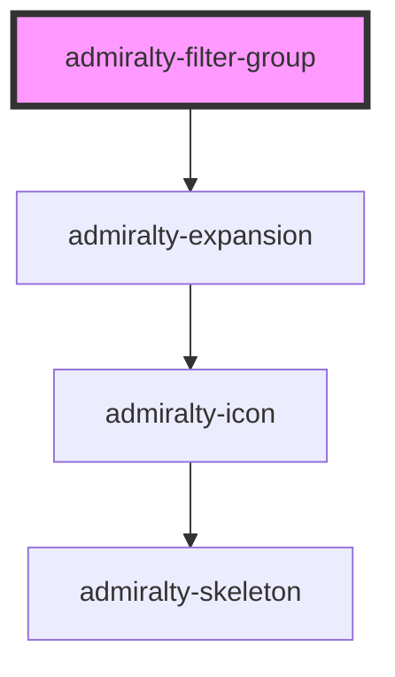

# admiralty-filter-group

<!-- Auto Generated Below -->

## Properties

| Property     | Attribute     | Description                   | Type     | Default     |
| ------------ | ------------- | ----------------------------- | -------- | ----------- |
| `groupTitle` | `group-title` | The title of the filter group | `string` | `undefined` |

## Slots

| Slot | Description                                                                                      |
| ---- | ------------------------------------------------------------------------------------------------ |
|      | You can place any content inside this element that you wish to use inside your filter component. |

## Dependencies

### Depends on

- [admiralty-expansion](../expansion)

### Graph

----------------------------------------------

*Built with [StencilJS](https://stenciljs.com/)*
