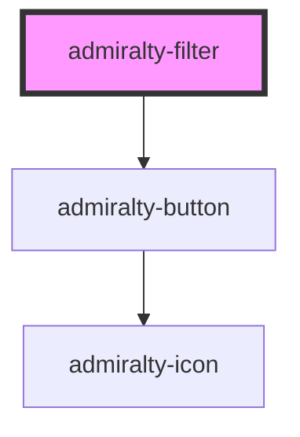

# admiralty-filter

<!-- Auto Generated Below -->

## Properties

| Property      | Attribute      | Description             | Type     | Default    |
| ------------- | -------------- | ----------------------- | -------- | ---------- |
| `filterTitle` | `filter-title` | The title of the filter | `string` | `'Filter'` |

## Events

| Event           | Description                                        | Type                |
| --------------- | -------------------------------------------------- | ------------------- |
| `filterApplied` | Event that is emitted when the filters are applied | `CustomEvent<void>` |
| `filterCleared` | Event that is emitted when the filters are cleared | `CustomEvent<void>` |

## Slots

| Slot | Description                                                                                                                                            |
| ---- | ------------------------------------------------------------------------------------------------------------------------------------------------------ |
|      | 'admiralty-filter-group' components can be placed inside of this element to render groups of filter controls. You can also place any elements you wish |

## Dependencies

### Depends on

- [admiralty-button](../button)

### Graph

----------------------------------------------

*Built with [StencilJS](https://stenciljs.com/)*
