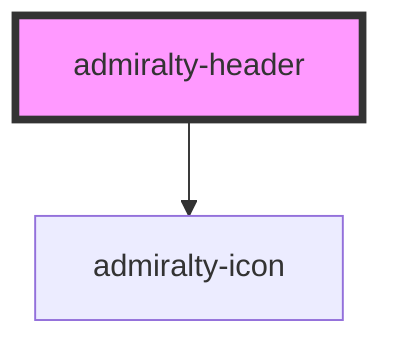

# admiralty-header

<!-- Auto Generated Below -->

## Properties

| Property         | Attribute          | Description                                                 | Type     | Default                            |
| ---------------- | ------------------ | ----------------------------------------------------------- | -------- | ---------------------------------- |
| `headerTitle`    | `header-title`     | The header title that is displayed to the right of the logo | `string` | `undefined`                        |
| `headerTitleUrl` | `header-title-url` | The url that clicking on the nav link will take you too     | `string` | `null`                             |
| `logoAltText`    | `logo-alt-text`    | The alternate image text for the logo image                 | `string` | `'Admiralty Stacked Logo'`         |
| `logoImgUrl`     | `logo-img-url`     | The uri of the logo image                                   | `string` | `'svg/Admiralty stacked logo.svg'` |
| `logoLinkUrl`    | `logo-link-url`    | The destination url when the logo is clicked                | `string` | `'https://www.admiralty.co.uk/'`   |

## Events

| Event           | Description                                                                    | Type                  |
| --------------- | ------------------------------------------------------------------------------ | --------------------- |
| `titledClicked` | Emits an event that can be listened to when the title in the header is clicked | `CustomEvent<string>` |

## Slots

| Slot        | Description                                                                                                                                          |
| ----------- | ---------------------------------------------------------------------------------------------------------------------------------------------------- |
| `"items"`   | 'admiralty-header-menu-item menu-title' and 'admiralty-header-menu-link menu-title' components are placed here for appropriate styling and behaviour |
| `"profile"` | 'admiralty-header-profile' components are placed here (the login/logout) options                                                                     |

## Dependencies

### Depends on

- [admiralty-icon](../icon)

### Graph

----------------------------------------------

*Built with [StencilJS](https://stenciljs.com/)*
