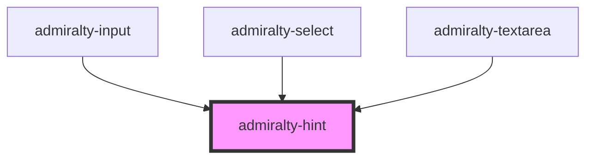

# admiralty-hint

<!-- Auto Generated Below -->

## Properties

| Property   | Attribute  | Description                                               | Type      | Default     |
| ---------- | ---------- | --------------------------------------------------------- | --------- | ----------- |
| `disabled` | `disabled` | The disabled option can be used to disable the component. | `boolean` | `undefined` |

## Slots

| Slot | Description                                                                                                |
| ---- | ---------------------------------------------------------------------------------------------------------- |
|      | The hint content should be placed in the slot e.g. `<admiralty-hint>Enter your full name</admiralty-hint>` |

## Dependencies

### Used by

 - [admiralty-input](../input)
 - [admiralty-select](../select)
 - [admiralty-textarea](../textarea)

### Graph

----------------------------------------------

*Built with [StencilJS](https://stenciljs.com/)*
