# admiralty-icon

<!-- Auto Generated Below -->

## Properties

| Property | Attribute | Description                                                                                                                                        | Type                | Default     |
| -------- | --------- | -------------------------------------------------------------------------------------------------------------------------------------------------- | ------------------- | ----------- |
| `name`   | `name`    | Name of the icon to be rendered.  A full list of available icons can be viewed at [https://fonts.google.com/icons](https://fonts.google.com/icons) | `string`            | `undefined` |
| `size`   | `size`    | The size of the icon in pixels. When not set, the icon height will be determined by the parent font size.                                          | `"unset" \| number` | `'unset'`   |

## CSS Custom Properties

| Name                         | Description           |
| ---------------------------- | --------------------- |
| `--admiralty-icon-font-size` | Font size of the icon |

## Dependencies

### Used by

 - [admiralty-autocomplete](../autocomplete)
 - [admiralty-breadcrumb](../breadcrumb)
 - [admiralty-button](../button)
 - [admiralty-dialogue](../dialogue)
 - [admiralty-expansion](../expansion)
 - [admiralty-file-input](../file-input)
 - [admiralty-header](../header)
 - [admiralty-icon-side-bar-item](../icon-side-bar-item)
 - [admiralty-input-invalid](../input-invalid)
 - [admiralty-pill](../pill)
 - [admiralty-read-more](../read-more)
 - [admiralty-select](../select)
 - [admiralty-side-bar-item](../side-bar-item)
 - [admiralty-text-side-bar-item](../text-side-bar-item)

### Graph

```mermaid
graph TD;
  admiralty-autocomplete --> admiralty-icon
  admiralty-breadcrumb --> admiralty-icon
  admiralty-button --> admiralty-icon
  admiralty-dialogue --> admiralty-icon
  admiralty-expansion --> admiralty-icon
  admiralty-file-input --> admiralty-icon
  admiralty-header --> admiralty-icon
  admiralty-icon-side-bar-item --> admiralty-icon
  admiralty-input-invalid --> admiralty-icon
  admiralty-pill --> admiralty-icon
  admiralty-read-more --> admiralty-icon
  admiralty-select --> admiralty-icon
  admiralty-side-bar-item --> admiralty-icon
  admiralty-text-side-bar-item --> admiralty-icon
  style admiralty-icon fill:#f9f,stroke:#333,stroke-width:4px
```

----------------------------------------------

*Built with [StencilJS](https://stenciljs.com/)*
