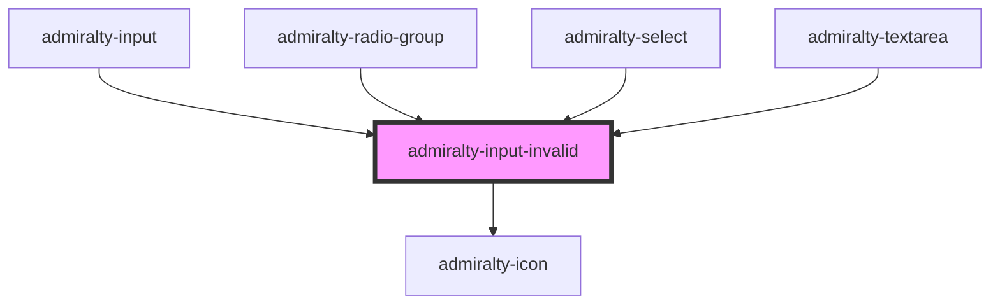

# admiralty-input-invalid

<!-- Auto Generated Below -->

## Slots

| Slot | Description                                                                                                                     |
| ---- | ------------------------------------------------------------------------------------------------------------------------------- |
|      | The error content should be placed in the slot e.g. `<admiralty-input-invalid>This field is required</admiralty-input-invalid>` |

## Dependencies

### Used by

 - [admiralty-input](../input)
 - [admiralty-radio-group](../radio-group)
 - [admiralty-select](../select)
 - [admiralty-textarea](../textarea)

### Depends on

- [admiralty-icon](../icon)

### Graph

----------------------------------------------

*Built with [StencilJS](https://stenciljs.com/)*
