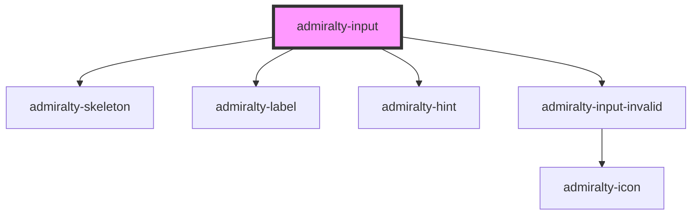

# admiralty-input

<!-- Auto Generated Below -->

## Overview

Once this component works, review whether a form field component should be created so
that shared properties such as `label`, `hint`, `disabled` etc. can be defined once.
Examples of similar components that can extend that base component are area, select
and checkbox.

## Properties

| Property         | Attribute         | Description                                                                               | Type                                                                                | Default     |
| ---------------- | ----------------- | ----------------------------------------------------------------------------------------- | ----------------------------------------------------------------------------------- | ----------- |
| `autocomplete`   | `autocomplete`    | Indicates whether the value of the control can be automatically completed by the browser. | `string`                                                                            | `'off'`     |
| `disabled`       | `disabled`        | This dictates whether the form field is disabled.                                         | `boolean`                                                                           | `false`     |
| `hint`           | `hint`            | The hint which will be used under the label to describe the input.                        | `string`                                                                            | `undefined` |
| `invalid`        | `invalid`         | Whether to show the input in an invalid state                                             | `boolean`                                                                           | `false`     |
| `invalidMessage` | `invalid-message` | The message to show when the input is invalid                                             | `string`                                                                            | `undefined` |
| `label`          | `label`           | The label which will be used above the input to describe the input.                       | `string`                                                                            | `undefined` |
| `loading`        | `loading`         | Whether the component is loading if so then show the skeleton                             | `boolean`                                                                           | `false`     |
| `loadingHeight`  | `loading-height`  | Height of the loading bar                                                                 | `string`                                                                            | `undefined` |
| `loadingRadius`  | `loading-radius`  | Radius of the loading bar                                                                 | `string`                                                                            | `undefined` |
| `loadingWidth`   | `loading-width`   | Width of the loading bar                                                                  | `string`                                                                            | `undefined` |
| `name`           | `name`            | The name of the control, which is submitted with the form data.                           | `string`                                                                            | `undefined` |
| `placeholder`    | `placeholder`     | The placeholder text to show in the input                                                 | `string`                                                                            | `undefined` |
| `required`       | `required`        | This dictates whether the input is required or not                                        | `boolean`                                                                           | `false`     |
| `type`           | `type`            | The input type, options are: text; number; date; time; email; password; tel; url          | `"date" \| "email" \| "number" \| "password" \| "tel" \| "text" \| "time" \| "url"` | `'text'`    |
| `value`          | `value`           | The value of the input.                                                                   | `number \| string`                                                                  | `''`        |
| `width`          | `width`           | The maximum width for the input field.                                                    | `number`                                                                            | `undefined` |

## Events

| Event            | Description                         | Type                                  |
| ---------------- | ----------------------------------- | ------------------------------------- |
| `admiraltyBlur`  | Emitted when the input loses focus. | `CustomEvent<FocusEvent>`             |
| `admiraltyFocus` | Emitted when the input gains focus. | `CustomEvent<FocusEvent>`             |
| `admiraltyInput` | Emitted when the value has changed. | `CustomEvent<InputChangeEventDetail>` |

## CSS Custom Properties

| Name                                   | Description                   |
| -------------------------------------- | ----------------------------- |
| `--admiralty-input-font-size`          | Font size of the input        |
| `--admiralty-input-font-weight`        | Font weight of the input      |
| `--admiralty-input-invalid-margin-top` | Margin top for invalid input. |
| `--admiralty-input-padding`            | Padding for the input.        |

## Dependencies

### Depends on

- [admiralty-skeleton](../skeleton)
- [admiralty-label](../label)
- [admiralty-hint](../hint)
- [admiralty-input-invalid](../input-invalid)

### Graph

----------------------------------------------

*Built with [StencilJS](https://stenciljs.com/)*
