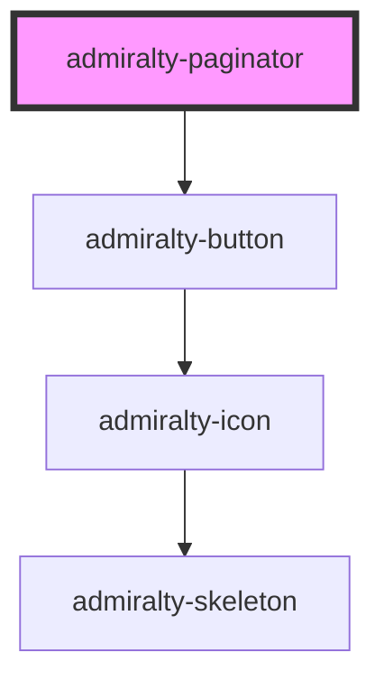

# admiralty-paginator

<!-- Auto Generated Below -->

## Properties

| Property      | Attribute      | Description                               | Type     | Default |
| ------------- | -------------- | ----------------------------------------- | -------- | ------- |
| `currentPage` | `current-page` | The current page. Defaults to 1.          | `number` | `1`     |
| `label`       | `label`        | The label to display.                     | `string` | `''`    |
| `pages`       | `pages`        | The total number of pages. Defaults to 1. | `number` | `1`     |

## Events

| Event        | Description                                                                                                  | Type                  |
| ------------ | ------------------------------------------------------------------------------------------------------------ | --------------------- |
| `pageChange` | Dispatched when the previous or next button is pressed. The event detail contains the requested page number. | `CustomEvent<number>` |

## CSS Custom Properties

| Name                                            | Description                               |
| ----------------------------------------------- | ----------------------------------------- |
| `--admiralty-paginator-button-margin`           | Margin for the paginator button           |
| `--admiralty-paginator-paragraph-margin-bottom` | Margin bottom for the paginator paragraph |
| `--admiralty-paginator-paragraph-padding`       | Padding for the paginator paragraph       |

## Dependencies

### Depends on

- [admiralty-button](../button)

### Graph

----------------------------------------------

*Built with [StencilJS](https://stenciljs.com/)*
