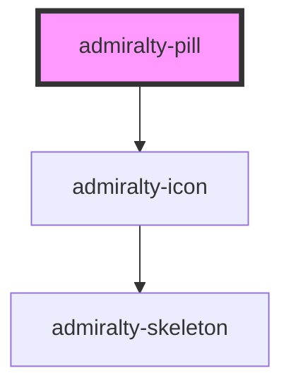

# admiralty-pill

<!-- Auto Generated Below -->

## Properties

| Property   | Attribute  | Description                           | Type                                           | Default            |
| ---------- | ---------- | ------------------------------------- | ---------------------------------------------- | ------------------ |
| `colour`   | `colour`   | The background colour of the pill.    | `"admiralty-blue" \| "bright-blue" \| "white"` | `'admiralty-blue'` |
| `label`    | `label`    | Label the pill.                       | `string`                                       | `undefined`        |
| `number`   | `number`   | The number of the pill.               | `string`                                       | `undefined`        |
| `selected` | `selected` | Whether to show the pill is selected. | `boolean`                                      | `false`            |
| `text`     | `text`     | The text of the pill.                 | `string`                                       | `undefined`        |

## Dependencies

### Depends on

- [admiralty-icon](../icon)

### Graph

----------------------------------------------

*Built with [StencilJS](https://stenciljs.com/)*
