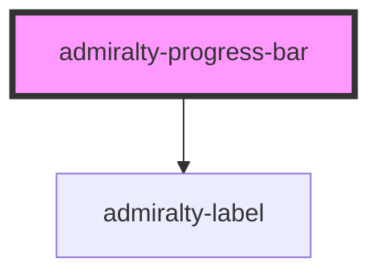

# admiralty-progress-bar

<!-- Auto Generated Below -->

## Properties

| Property      | Attribute     | Description                                                             | Type      | Default     |
| ------------- | ------------- | ----------------------------------------------------------------------- | --------- | ----------- |
| `error`       | `error`       | Set to true to indicate an error (turns the progress bar red)           | `boolean` | `false`     |
| `label`       | `label`       | If set, adds a label above the progress bar                             | `string`  | `undefined` |
| `progression` | `progression` | * A value from 0 - 100 that visually represents the current progression | `number`  | `0`         |

## Dependencies

### Depends on

- [admiralty-label](../label)

### Graph

----------------------------------------------

*Built with [StencilJS](https://stenciljs.com/)*
