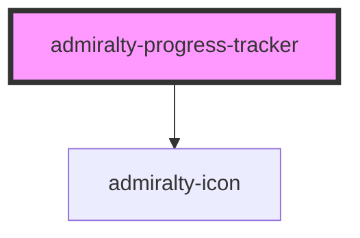

# admiralty-progress-tracker

A progress tracker component that displays a vertical list of steps in a multi-step process. Each step can have a status (complete, current, upcoming, or error) and can display summary information and bullet points.

## Usage

### Declarative Approach (Recommended)

Use child `admiralty-progress-tracker-step` components to define your steps:

```html
<admiralty-progress-tracker allow-back-navigation>
  <admiralty-progress-tracker-step step-id="location" step-title="Choose location" status="complete" summary="Specify geographic coordinates">
    <ul slot="bullet-summaries">
      <li>Latitude: 51deg 30m 35s N</li>
      <li>Longitude: 0deg 7m 5s W</li>
    </ul>
  </admiralty-progress-tracker-step>

  <admiralty-progress-tracker-step step-id="object" step-title="Choose object" status="current"></admiralty-progress-tracker-step>

  <admiralty-progress-tracker-step step-id="date" step-title="Choose date" status="upcoming"></admiralty-progress-tracker-step>
</admiralty-progress-tracker>
```

### With Angular

```html
<admiralty-progress-tracker [allowBackNavigation]="true" (stepClicked)="onStepClicked($event)">
  <admiralty-progress-tracker-step *ngFor="let step of steps" [stepId]="step.id" [stepTitle]="step.title" [status]="step.status" [summary]="step.summary">
    <ul slot="bullet-summaries" *ngIf="step.bulletSummaries?.length">
      <li *ngFor="let bullet of step.bulletSummaries">{{ bullet }}</li>
    </ul>
  </admiralty-progress-tracker-step>
</admiralty-progress-tracker>
```

## Features

- **Visual Status Indicators**: Each step displays a visual marker showing its status (complete, current, upcoming, or error)
- **Navigation**: Optionally allow users to navigate back to previous steps
- **Summary Information**: Show bullet point summaries under each step
- **Accessibility**: Full keyboard navigation and screen reader support

<!-- Auto Generated Below -->


## Properties

| Property                 | Attribute                  | Description                                     | Type      | Default |
| ------------------------ | -------------------------- | ----------------------------------------------- | --------- | ------- |
| `allowBackNavigation`    | `allow-back-navigation`    | Whether navigation to previous steps is allowed | `boolean` | `true`  |
| `allowForwardNavigation` | `allow-forward-navigation` | Whether navigation to future steps is allowed   | `boolean` | `true`  |


## Events

| Event         | Description                        | Type                                |
| ------------- | ---------------------------------- | ----------------------------------- |
| `stepClicked` | Emitted when user clicks on a step | `CustomEvent<StepNavigationDetail>` |


## CSS Custom Properties

| Name                                                      | Description                                         |
| --------------------------------------------------------- | --------------------------------------------------- |
| `--admiralty-progress-tracker-bullet-summary-font-size`   | Font size for bullet summary lists.                 |
| `--admiralty-progress-tracker-content-padding-bottom`     | Bottom padding for each step content area.          |
| `--admiralty-progress-tracker-error-colour`               | Text colour for error messages.                     |
| `--admiralty-progress-tracker-item-gap`                   | Gap between marker rail and content for each step.  |
| `--admiralty-progress-tracker-item-min-height`            | Minimum height for each step row.                   |
| `--admiralty-progress-tracker-line-colour`                | Colour of the default connector line.               |
| `--admiralty-progress-tracker-line-complete-colour`       | Colour of the connector line for completed steps.   |
| `--admiralty-progress-tracker-line-error-colour`          | Colour of the connector line for error steps.       |
| `--admiralty-progress-tracker-line-width`                 | Width of the connecting line between markers.       |
| `--admiralty-progress-tracker-marker-border-width`        | Border width for the step marker.                   |
| `--admiralty-progress-tracker-marker-complete-background` | Background colour for complete step markers.        |
| `--admiralty-progress-tracker-marker-complete-border`     | Border colour for complete step markers.            |
| `--admiralty-progress-tracker-marker-current-background`  | Background colour for current step markers.         |
| `--admiralty-progress-tracker-marker-current-border`      | Border colour for current step markers.             |
| `--admiralty-progress-tracker-marker-error-background`    | Background colour for error step markers.           |
| `--admiralty-progress-tracker-marker-error-border`        | Border colour for error step markers.               |
| `--admiralty-progress-tracker-marker-size`                | Size of the circular step marker.                   |
| `--admiralty-progress-tracker-marker-transition`          | Transition used for marker and title state changes. |
| `--admiralty-progress-tracker-marker-upcoming-background` | Background colour for upcoming step markers.        |
| `--admiralty-progress-tracker-marker-upcoming-border`     | Border colour for upcoming step markers.            |
| `--admiralty-progress-tracker-marker-upcoming-text`       | Text colour for upcoming step markers.              |
| `--admiralty-progress-tracker-rail-width`                 | Width of the marker rail column.                    |
| `--admiralty-progress-tracker-summary-colour`             | Text colour for step summaries.                     |
| `--admiralty-progress-tracker-summary-disabled-colour`    | Text colour for disabled/upcoming summaries.        |
| `--admiralty-progress-tracker-summary-font-size`          | Font size for the step summary.                     |
| `--admiralty-progress-tracker-title-colour`               | Text colour for step titles.                        |
| `--admiralty-progress-tracker-title-font-size`            | Font size for the step title.                       |
| `--admiralty-progress-tracker-title-font-weight`          | Font weight for the step title.                     |


## Dependencies

### Depends on

- [admiralty-icon](../icon)

### Graph


----------------------------------------------

*Built with [StencilJS](https://stenciljs.com/)*
