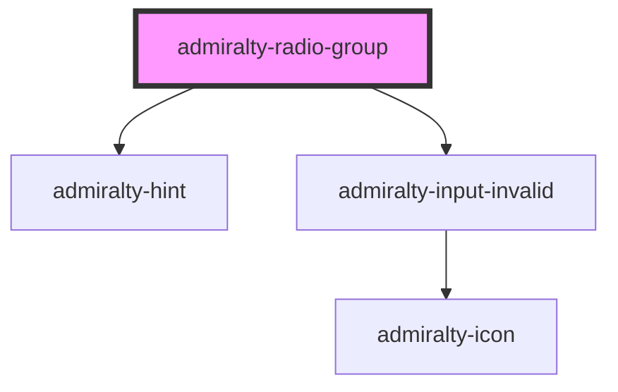

# radio-group

<!-- Auto Generated Below -->

## Properties

| Property          | Attribute          | Description                                                                      | Type      | Default        |
| ----------------- | ------------------ | -------------------------------------------------------------------------------- | --------- | -------------- |
| `disabled`        | `disabled`         | Whether the radio controls should be disabled                                    | `boolean` | `false`        |
| `displayVertical` | `display-vertical` | Setting this to false displays the radio options horizontally (defaults to true) | `boolean` | `true`         |
| `hint`            | `hint`             | The hint text to display below the label                                         | `string`  | `undefined`    |
| `invalid`         | `invalid`          | Whether to show the input in an invalid state                                    | `boolean` | `false`        |
| `invalidMessage`  | `invalid-message`  | The message to show when the input is invalid                                    | `string`  | `undefined`    |
| `label`           | `label`            | The label text to display above the control                                      | `string`  | `undefined`    |
| `name`            | `name`             | The name of the control, which is submitted with the form data                   | `string`  | `this.inputId` |
| `value`           | `value`            | The value of the radio group                                                     | `any`     | `undefined`    |

## Events

| Event             | Description                                       | Type                                            |
| ----------------- | ------------------------------------------------- | ----------------------------------------------- |
| `admiraltyChange` | Event fired when the checked radio button changes | `CustomEvent<RadioGroupChangeEventDetail<any>>` |

## CSS Custom Properties

| Name                                                  | Description                                                 |
| ----------------------------------------------------- | ----------------------------------------------------------- |
| `--admiralty-radio-group-fieldset-padding`            | Padding for the fieldset of the radio group                 |
| `--admiralty-radio-group-legend-font-weight`          | Font weight for the radio group legend                      |
| `--admiralty-radio-group-legend-margin-bottom`        | Margin bottom for the legend of the radio group             |
| `--admiralty-radio-group-slotted-margin-right`        | Margin right for the slotted data of the radio group        |
| `--admiralty-radio-group-stack-slotted-margin-bottom` | Margin bottom for the slotted data of the radio group stack |

## Dependencies

### Depends on

- [admiralty-hint](../hint)
- [admiralty-input-invalid](../input-invalid)

### Graph

----------------------------------------------

*Built with [StencilJS](https://stenciljs.com/)*
