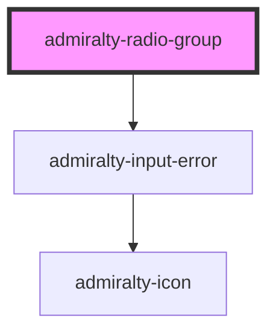

# radio-group

<!-- Auto Generated Below -->

## Properties

| Property          | Attribute          | Description                                                                 | Type      | Default        |
| ----------------- | ------------------ | --------------------------------------------------------------------------- | --------- | -------------- |
| `displayVertical` | `display-vertical` | Setting this true displays the radio options vertically (defaults to false) | `boolean` | `false`        |
| `invalid`         | `invalid`          | Whether to show the input in an invalid state                               | `boolean` | `false`        |
| `invalidMessage`  | `invalid-message`  | The message to show when the input is invalid                               | `string`  | `undefined`    |
| `name`            | `name`             | The name of the control, which is submitted with the form data              | `string`  | `this.inputId` |
| `value`           | `value`            | The value of the radio group                                                | `any`     | `undefined`    |

## Events

| Event             | Description                                       | Type                                            |
| ----------------- | ------------------------------------------------- | ----------------------------------------------- |
| `admiraltyChange` | Event fired when the checked radio button changes | `CustomEvent<RadioGroupChangeEventDetail<any>>` |

## Dependencies

### Depends on

- [admiralty-input-error](../input-error)

### Graph

----------------------------------------------

*Built with [StencilJS](https://stenciljs.com/)*
