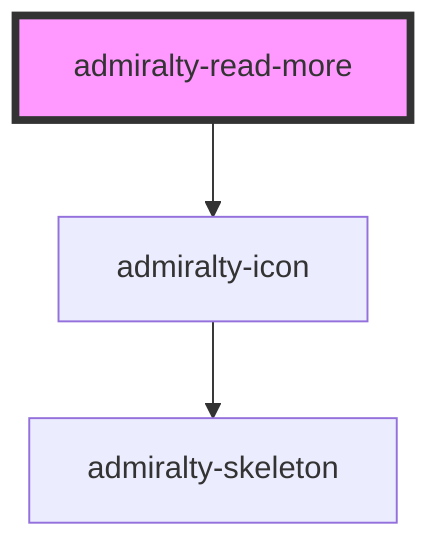

# admiralty-read-more

<!-- Auto Generated Below -->

## Properties

| Property  | Attribute | Description                                                   | Type     | Default     |
| --------- | --------- | ------------------------------------------------------------- | -------- | ----------- |
| `heading` | `heading` | The text to display in the heading of the readmore component. | `string` | `undefined` |

## Events

| Event              | Description                                                       | Type                   |
| ------------------ | ----------------------------------------------------------------- | ---------------------- |
| `admiraltyToggled` | The event that is dispatched when the expanded status is toggled. | `CustomEvent<boolean>` |

## Dependencies

### Depends on

- [admiralty-icon](../icon)

### Graph

----------------------------------------------

*Built with [StencilJS](https://stenciljs.com/)*
