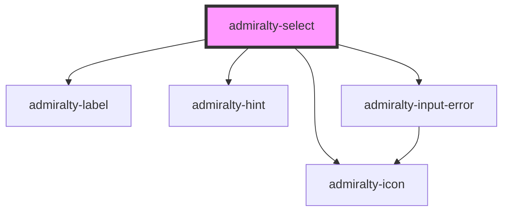

# admiralty-select

<!-- Auto Generated Below -->

## Properties

| Property         | Attribute         | Description                                             | Type               | Default             |
| ---------------- | ----------------- | ------------------------------------------------------- | ------------------ | ------------------- |
| `disabled`       | `disabled`        | If `true`, the user cannot interact with the select.    | `boolean`          | `false`             |
| `hint`           | `hint`            | The text that will be used as a field label.            | `string`           | `null`              |
| `invalid`        | `invalid`         | Whether to show that the select is in an invalid state. | `boolean`          | `false`             |
| `invalidMessage` | `invalid-message` | The message to show when the select is invalid.         | `string`           | `null`              |
| `label`          | `label`           | The text that will be used as a field label.            | `string`           | `'Choose a colour'` |
| `value`          | `value`           | The value of the input.                                 | `number \| string` | `''`                |
| `width`          | `width`           | The maximum width (px) for the input field.             | `number`           | `undefined`         |

## Events

| Event             | Description                             | Type                                   |
| ----------------- | --------------------------------------- | -------------------------------------- |
| `admiraltyBlur`   | Emitted when the component loses focus. | `CustomEvent<void>`                    |
| `admiraltyChange` | Emitted when the value has changed.     | `CustomEvent<SelectChangeEventDetail>` |

## Dependencies

### Depends on

- [admiralty-label](../label)
- [admiralty-hint](../hint)
- [admiralty-icon](../icon)
- [admiralty-input-error](../input-error)

### Graph

----------------------------------------------

*Built with [StencilJS](https://stenciljs.com/)*
