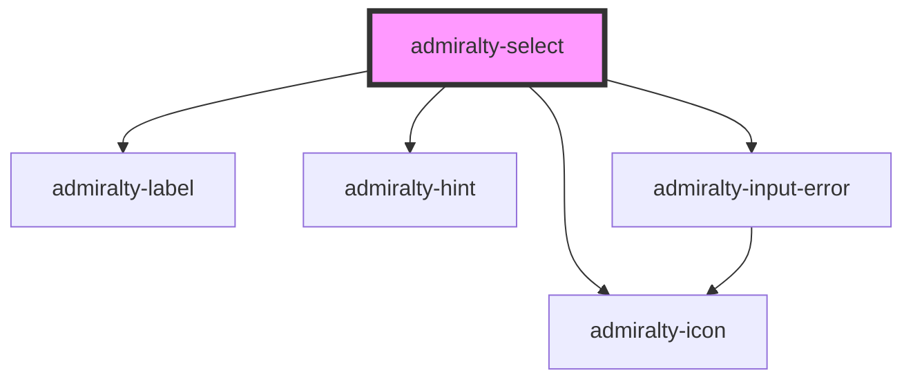

# admiralty-select

<!-- Auto Generated Below -->

## Properties

| Property    | Attribute    | Description                                                                           | Type      | Default             |
| ----------- | ------------ | ------------------------------------------------------------------------------------- | --------- | ------------------- |
| `disabled`  | `disabled`   | If `true`, the user cannot interact with the select.                                  | `boolean` | `false`             |
| `error`     | `error`      | If 'true', the 'error' class is added to suggest an error                             | `boolean` | `false`             |
| `errorHint` | `error-hint` | The hint that is used to inform the user of an error (displayed below the select box) | `string`  | `null`              |
| `hint`      | `hint`       | The text that will be used as a field label.                                          | `string`  | `null`              |
| `label`     | `label`      | The text that will be used as a field label.                                          | `string`  | `'Choose a colour'` |
| `width`     | `width`      | The maximum width (px) for the input field.                                           | `number`  | `undefined`         |

## Events

| Event             | Description                             | Type                       |
| ----------------- | --------------------------------------- | -------------------------- |
| `admiraltyBlur`   | Emitted when the component loses focus. | `CustomEvent<void>`        |
| `admiraltyChange` | Emitted when the value has changed.     | `CustomEvent<EventTarget>` |

## Dependencies

### Depends on

- [admiralty-label](../label)
- [admiralty-hint](../hint)
- [admiralty-icon](../icon)
- [admiralty-input-error](../input-error)

### Graph

----------------------------------------------

*Built with [StencilJS](https://stenciljs.com/)*
