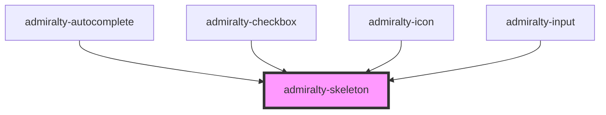

# admiralty-skeleton

<!-- Auto Generated Below -->

## Properties

| Property      | Attribute      | Description                                                                                                                   | Type      | Default   |
| ------------- | -------------- | ----------------------------------------------------------------------------------------------------------------------------- | --------- | --------- |
| `height`      | `height`       | Height of the skeleton component, default is set to 1rem.                                                                     | `string`  | `'1rem'`  |
| `noAnimation` | `no-animation` | Hides the animation of a shimmer on the skeleton component, default is set to false, set to true if you require no animation. | `boolean` | `false`   |
| `radius`      | `radius`       | Radius of the skeleton component, default is .5rem.                                                                           | `string`  | `'.5rem'` |
| `width`       | `width`        | Width of the skeleton component, default is set to 100%.                                                                      | `string`  | `'100%'`  |

## CSS Custom Properties

| Name                                           | Description                                            |
| ---------------------------------------------- | ------------------------------------------------------ |
| `--admiralty-skeleton-animation-duration`      | duration of the sheen going across the skeleton        |
| `--admiralty-skeleton-background-colour`       | background colour for loading elements.                |
| `--admiralty-skeleton-background-sheen-colour` | background sheen animation colour for loading elements |

## Dependencies

### Used by

 - [admiralty-autocomplete](../autocomplete)
 - [admiralty-checkbox](../checkbox)
 - [admiralty-icon](../icon)
 - [admiralty-input](../input)

### Graph

----------------------------------------------

*Built with [StencilJS](https://stenciljs.com/)*
