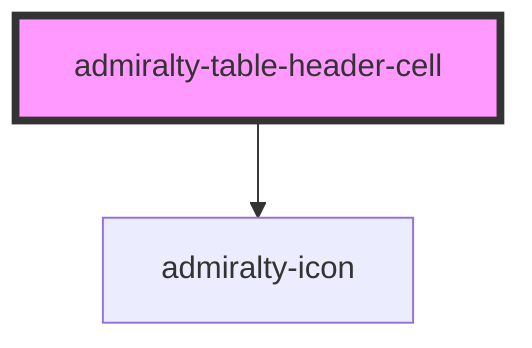

# table-header-cell

<!-- Auto Generated Below -->

## Overview

The table header cell element is used for showing headings for the columns

## Properties

| Property        | Attribute        | Description                                                                                                                                                                                          | Type                                    | Default     |
| --------------- | ---------------- | ---------------------------------------------------------------------------------------------------------------------------------------------------------------------------------------------------- | --------------------------------------- | ----------- |
| `sortDirection` | `sort-direction` | The initial sort direction for this column.                                                                                                                                                          | `"ascending" \| "descending" \| "none"` | `'none'`    |
| `sortable`      | `sortable`       | Whether this column header is individually sortable. If the parent `admiralty-table` has `sorting` set, all columns are sortable by default and this prop can be set to `false` to opt a column out. | `boolean`                               | `undefined` |

## Events

| Event                 | Description                                                                                                                                 | Type                                                                 |
| --------------------- | ------------------------------------------------------------------------------------------------------------------------------------------- | -------------------------------------------------------------------- |
| `admiraltySortChange` | Emitted when the user clicks the sort button. The `detail` contains the new `direction` value (`'ascending'`, `'descending'`, or `'none'`). | `CustomEvent<{ direction: "none" \| "ascending" \| "descending"; }>` |

## Slots

| Slot | Description                                        |
| ---- | -------------------------------------------------- |
|      | The content you wish to show as part of the header |

## CSS Custom Properties

| Name                                                       | Description                                                     |
| ---------------------------------------------------------- | --------------------------------------------------------------- |
| `--admiralty-table-header-cell-font-size`                  | Font size for the table header cell                             |
| `--admiralty-table-header-cell-font-weight`                | Font weight for the table header cell                           |
| `--admiralty-table-header-cell-padding`                    | Padding for the table header cell                               |
| `--admiralty-table-header-cell-sort-icon-inactive-opacity` | Opacity of the sort icon when the column is not actively sorted |
| `--admiralty-table-header-cell-sortable-hover-bg`          | Background colour on hover for sortable header cells            |

## Dependencies

### Depends on

- [admiralty-icon](../icon)

### Graph

----------------------------------------------

*Built with [StencilJS](https://stenciljs.com/)*
