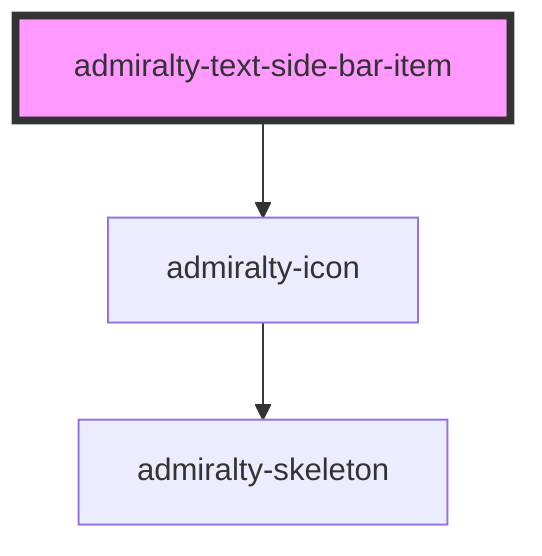

# admiralty-text-side-bar-item

<!-- Auto Generated Below -->

## Properties

| Property           | Attribute           | Description                                                                                                                                                                                         | Type                                   | Default                             |
| ------------------ | ------------------- | --------------------------------------------------------------------------------------------------------------------------------------------------------------------------------------------------- | -------------------------------------- | ----------------------------------- |
| `active`           | `active`            | Represents whether this SideBarItem is 'active' and will be styled differently than SideBarItems that are not 'active'. There should only be one SideBarItem that is 'active' per SideBar.          | `boolean`                              | `false`                             |
| `expanded`         | `expanded`          | Whether the component is expanded.                                                                                                                                                                  | `boolean`                              | `false`                             |
| `href`             | `href`              | The URL to link to.                                                                                                                                                                                 | `string`                               | `undefined`                         |
| `icon`             | `icon`              | The name of the icon to display. A full list of available icons can be viewed at [https://fonts.google.com/icons](https://fonts.google.com/icons)                                                   | `string`                               | `undefined`                         |
| `itemText`         | `item-text`         | Item text for the button or link depending on variant                                                                                                                                               | `string`                               | `undefined`                         |
| `suppressRedirect` | `suppress-redirect` | Causes the default browser redirect to be suppressed. Can be used in conjunction with the `onTextSideBarItemClick` event to use a navigation router and prevent a full page reload when navigating. | `boolean`                              | `false`                             |
| `variant`          | `variant`           | The type of text side bar item to render. Valid values are `primary` and `secondary`. Default value is `primary`.                                                                                   | `"expandable" \| "text" \| "textLink"` | `TextSideBarItemVariant.Expandable` |

## Events

| Event                  | Description                                                                       | Type                   |
| ---------------------- | --------------------------------------------------------------------------------- | ---------------------- |
| `textSideBarItemClick` | An event emitted when this Side Bar item is selected containing the sideBarItemId | `CustomEvent<string>`  |
| `toggled`              | The event that is dispatched when the expanded status is toggled.                 | `CustomEvent<boolean>` |

## Slots

| Slot                                                         | Description |
| ------------------------------------------------------------ | ----------- |
| `"The text to display under the icon for secondary variant"` |             |

## CSS Custom Properties

| Name                                        | Description                                   |
| ------------------------------------------- | --------------------------------------------- |
| `--admiralty-side-bar-item-font-size`       | Font size for the side bar item               |
| `--admiralty-side-bar-item-font-weight`     | Font weight for the side bar item             |
| `--admiralty-side-bar-item-icon-font-size`  | Font size for the side bar item icon          |
| `--admiralty-text-link-active-font-weight`  | Font weight for text link active              |
| `--admiralty-text-link-font-weight`         | Font weight for text link                     |
| `--admiralty-text-link-is-main-font-weight` | Font weight for text link that is a main link |

## Dependencies

### Depends on

- [admiralty-icon](../icon)

### Graph

----------------------------------------------

*Built with [StencilJS](https://stenciljs.com/)*
