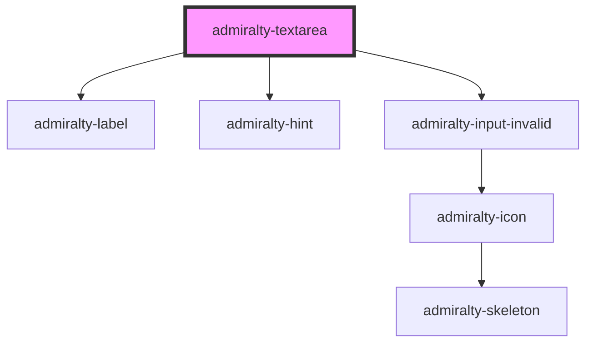

# admiralty-textarea

<!-- Auto Generated Below -->

## Properties

| Property         | Attribute         | Description                                                                                                    | Type               | Default     |
| ---------------- | ----------------- | -------------------------------------------------------------------------------------------------------------- | ------------------ | ----------- |
| `disabled`       | `disabled`        | This dictates whether the form field is disabled.                                                              | `boolean`          | `false`     |
| `hint`           | `hint`            | The hint which will be used under the label to describe the input.                                             | `string`           | `undefined` |
| `invalid`        | `invalid`         | Whether to show the input in an invalid state                                                                  | `boolean`          | `false`     |
| `invalidMessage` | `invalid-message` | The message to show when the input is invalid                                                                  | `string`           | `undefined` |
| `label`          | `label`           | The label which will be used as a placeholder in the unfilled state, and as a field label in the filled state. | `string`           | `''`        |
| `value`          | `value`           | The value of the textarea.                                                                                     | `number \| string` | `''`        |
| `width`          | `width`           | The maximum width for the input field.                                                                         | `number`           | `undefined` |

## Events

| Event            | Description                                      | Type                                     |
| ---------------- | ------------------------------------------------ | ---------------------------------------- |
| `admiraltyInput` | Event is fired when the form control changes     | `CustomEvent<TextAreaChangeEventDetail>` |
| `textareaBlur`   | Event is fired when the form control loses focus | `CustomEvent<any>`                       |

## CSS Custom Properties

| Name                                | Description                   |
| ----------------------------------- | ----------------------------- |
| `--admiralty-text-area-font-weight` | Font weight for the text area |
| `--admiralty-text-area-padding`     | Padding for text area         |

## Dependencies

### Depends on

- [admiralty-label](../label)
- [admiralty-hint](../hint)
- [admiralty-input-invalid](../input-invalid)

### Graph

----------------------------------------------

*Built with [StencilJS](https://stenciljs.com/)*
