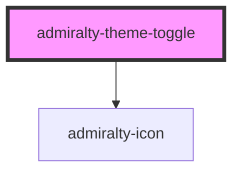

# admiralty-theme-toggle

<!-- Auto Generated Below -->

## Properties

| Property    | Attribute    | Description                                                                                                   | Type                          | Default              |
| ----------- | ------------ | ------------------------------------------------------------------------------------------------------------- | ----------------------------- | -------------------- |
| `ariaLabel` | `aria-label` | Label for accessibility. Defaults to "Toggle dark mode".                                                      | `string`                      | `'Toggle dark mode'` |
| `disabled`  | `disabled`   | Whether the toggle should be disabled.                                                                        | `boolean`                     | `false`              |
| `theme`     | `theme`      | The current theme preference. Can be 'light', 'dark', or 'auto' (system preference). Default value is 'auto'. | `"auto" \| "dark" \| "light"` | `'auto'`             |

## Events

| Event                  | Description                                      | Type                                        |
| ---------------------- | ------------------------------------------------ | ------------------------------------------- |
| `admiraltyThemeChange` | Event is fired when the theme preference changes | `CustomEvent<ThemeToggleChangeEventDetail>` |

## CSS Custom Properties

| Name                                                | Description                            |
| --------------------------------------------------- | -------------------------------------- |
| `--admiralty-theme-toggle-active-background-colour` | Active background colour               |
| `--admiralty-theme-toggle-background-colour`        | Background colour of the toggle button |
| `--admiralty-theme-toggle-border-radius`            | Border radius of the toggle button     |
| `--admiralty-theme-toggle-disabled-opacity`         | Opacity when disabled                  |
| `--admiralty-theme-toggle-focus-colour`             | Focus outline colour                   |
| `--admiralty-theme-toggle-hover-background-colour`  | Hover background colour                |
| `--admiralty-theme-toggle-icon-colour`              | Colour of the toggle icons             |
| `--admiralty-theme-toggle-size`                     | Size of the toggle button              |
| `--admiralty-theme-toggle-slider-background-colour` | Background colour of the slider        |
| `--admiralty-theme-toggle-slider-colour`            | Colour of the active slider indicator  |

## Dependencies

### Depends on

- [admiralty-icon](../icon)

### Graph

----------------------------------------------

*Built with [StencilJS](https://stenciljs.com/)*
