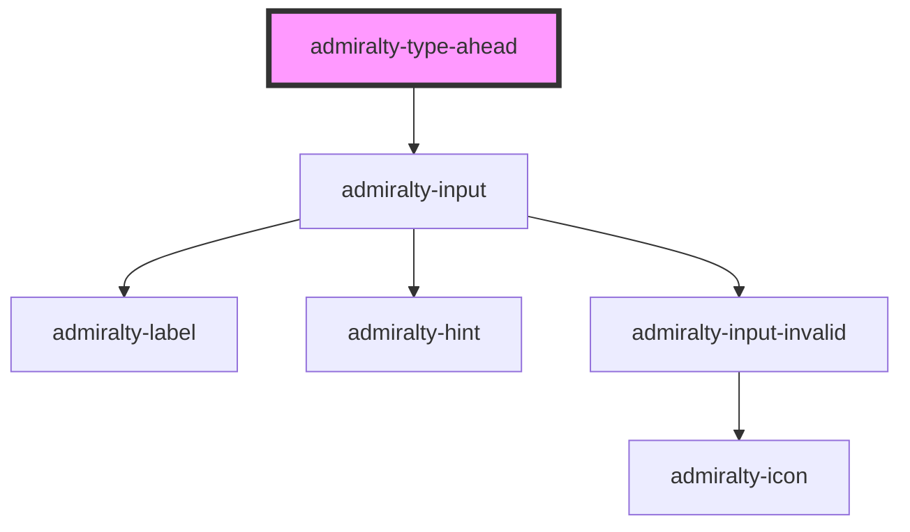

# admiralty-type-ahead

<!-- Auto Generated Below -->

## Properties

| Property             | Attribute               | Description                                                          | Type      | Default     |
| -------------------- | ----------------------- | -------------------------------------------------------------------- | --------- | ----------- |
| `hint`               | `hint`                  | The hint which will be used under the label to describe the input.   | `string`  | `undefined` |
| `label`              | `label`                 | The text content of the label for the input box                      | `string`  | `undefined` |
| `placeholder`        | `placeholder`           | The placeholder text for the input field                             | `string`  | `undefined` |
| `resultsOnInitFocus` | `results-on-init-focus` | Optional property to show results when input box is initally focused | `boolean` | `false`     |
| `value`              | `value`                 | The value of the textinput                                           | `string`  | `undefined` |

## Events

| Event              | Description                                                                                                              | Type                  |
| ------------------ | ------------------------------------------------------------------------------------------------------------------------ | --------------------- |
| `selectionChanged` | Optional function that will be executed when the user selects an item from the typeahead                                 | `CustomEvent<string>` |
| `valueChanged`     | Event that is fired whenever the value of the typeahead changes e.g. selection from the dropdown or manually typed entry | `CustomEvent<string>` |

## Dependencies

### Depends on

- [admiralty-input](../input)

### Graph

----------------------------------------------

*Built with [StencilJS](https://stenciljs.com/)*
